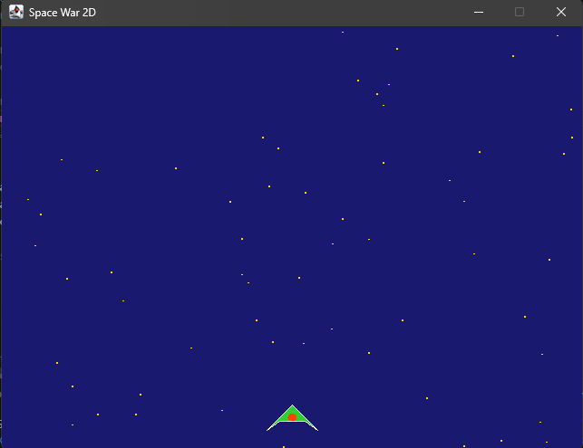
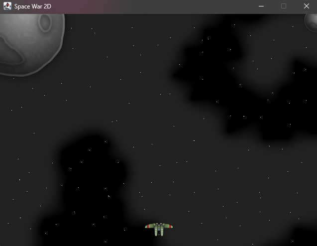
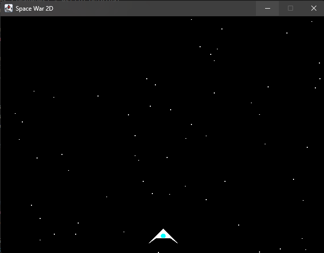

# Refactorización de Juego con Abstract Factory

Este proyecto demuestra la implementación del patrón de diseño **Abstract Factory** (Fábrica Abstracta) en un videojuego simple "Space War". El objetivo es permitir la creación de diferentes familias de objetos de juego (enemigos, nave del jugador, balas, fondo) sin especificar sus clases concretas.


## Cómo visualizar cada estilo

El juego está configurado para cambiar de estilo modificando una sola línea de código en la clase `Game.java`.

### Pasos para cambiar el estilo:

1.  Abre el archivo `src/main/java/com/balitechy/spacewar/main/Game.java`.
2.  Busca el método `init()`.
3.  Descomenta la línea de la fábrica que deseas usar y comenta las demás.

```java
// Ejemplo en Game.java:

// Opción 1: Sprites (imágenes) - estilo original
// factory = new SpriteGameElementsFactory(sprites);

// Opción 2: Vectorial (formas geométricas)
// factory = new VectorialGameElementsFactory();

// Opción 3: Vectorial Colorido 
factory = new ColorfulVectorialGameElementsFactory();
```

## Ejemplos de Estilos

A continuación se muestran ejemplos de cómo se ve el juego con cada configuración.

### 1. Estilo Vectorial Colorido
Usa `ColorfulVectorialGameElementsFactory`. Este estilo utiliza formas geométricas con colores personalizados.



### 2. Estilo Sprites
Usa `SpriteGameElementsFactory`. Este es el estilo clásico que utiliza imágenes de mapa de bits (sprites) para los elementos.



### 3. Estilo Vectorial
Usa `VectorialGameElementsFactory`. Este estilo utiliza formas vectoriales básicas (líneas, círculos) sin texturas complejas, ideal para un look "retro" minimalista.



## Ejecución

Para ejecutar el juego, compila y corre la clase principal `Game`:

```bash
# Si usas Maven
mvn clean compile exec:java
```
